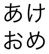
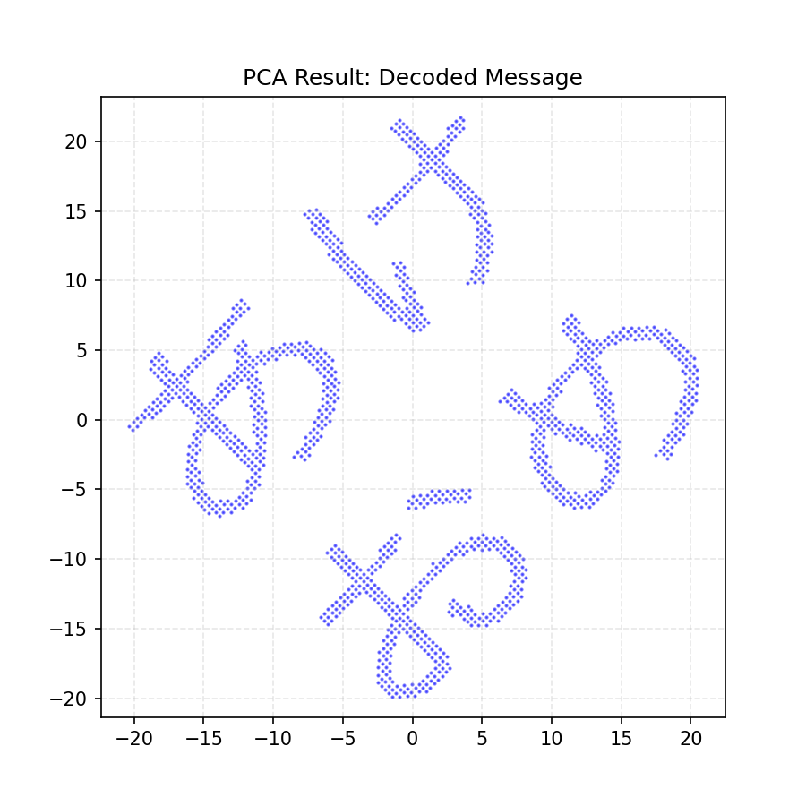

# PCA_akeome

あるサンプルが存在する．これを PCA による次元削減を経て，2次元直交座標系にプロットすると，「あけおめ」という文字が表示される試み．

サンプルは 10次元程度にしておき，データだけを見てもわからないように偽装する．

## 作成手順
1. まず，白キャンバスを用意し，ピクセル上に「あけおめ」という文字を手書きする．
2. これを2次元座標型に落とし込む．
3. この2次元座標の分散を最も高くなるようにしつつ，他の8次元をランダムに追加する．
4. ランダムな直交行列を掛けて，10次元空間内でデータを回転させ，ランダムにする．

## 詳細
### 1. まず，白キャンバスを用意し，ピクセル上に「あけおめ」という文字を手書きする．
draw.io を使用して，文字と描画した．

### 2. これを2次元座標型に落とし込む
画像処理ライブラリ（PIL/Pillow）を使用して画像を読み込み，色が黒い部分の座標だけを抽出した．

### 3. この2次元座標の分散を最も高くなるようにしつつ，他の8次元をランダムに追加する
PCA は，データの中から分散を見つけ出し，それを第1主成分として採用する．この性質を逆手に取る．
「あけおめ」の座標データを10倍にスケールアップし，分散を意図的に大きくする．
残りの8次元分として，分散の小さい（標準正規分布に従う）ランダムな数値を生成する．
これらを結合し，10次元のデータ [x, y, noise1, ..., noise8] を作成した．

### 4. ランダムな直交行列を掛けて，10次元空間内でデータを回転させ，ランダムにする
10次元空間全体を「回転」させる． 
ランダムに生成した直交行列を行列計算で掛け合わせて，元々の x や y の情報が複数の次元に複雑に混ざり合う．
CSVファイルの中身を見ると，人間には全く意味のわからない数字の羅列になっており，どの列を見ても文字の形跡は確認できない．

## 結果：PCAによる復元
作成された10次元データ（CSV）を読み込み，ライブラリの sklearn を用いて2次元に次元圧縮を行った結果が以下である．

ランダムに回転され隠されていたはずのデータから，PCAが最も分散の大きい成分を見つけ出したことで，元の「あけおめ」という文字がプロットされた．

